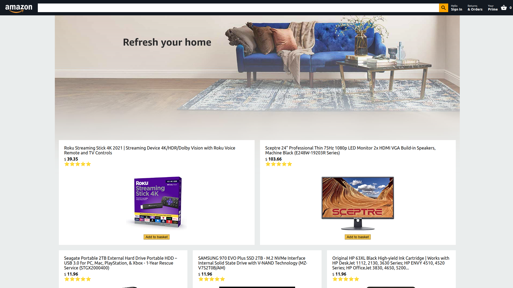
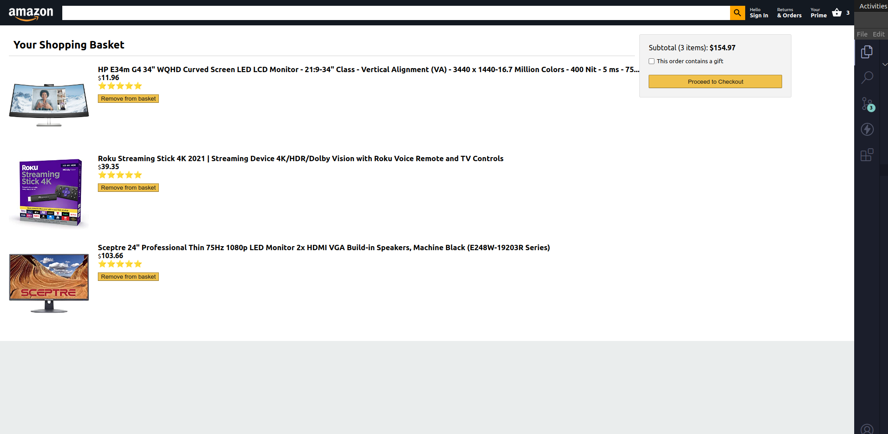

#  Amazon Clone

### _Amazon Clone built using ReactJs and Firebase hope you like it.

### Learned from : Clever Programmer :link: https://youtu.be/1_IYL9ZMR_Y

### Link :link: https://amazon-reactjs-clone.netlify.app/

## Images

## Run Locally

- Run this command `git clone https://github.com/Dish1701/Amazon-React-Clone.git`
- You are now in the dev environment and you can play around

## Tech Stack

- React.js
- CSS3
- Firebase
